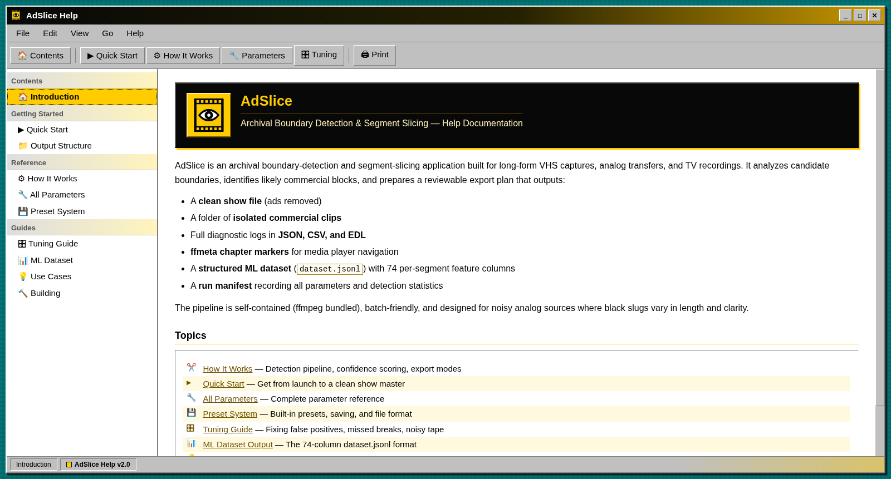

<p align="center">
  
</p>

<h1 align="center">AdSlicer</h1>

<p align="center">
  <strong>Archival boundary detection and segment slicing for VHS, analog transfers, and long-form broadcast recordings.</strong>
</p>

<p align="center">
  
  
  
  
</p>

<p align="center">
  <a href="#quick-start">Quick Start</a> ·
  <a href="#how-it-works">How It Works</a> ·
  <a href="#building-from-source">Build</a> ·
  <a href="docs/index.html">Help Documentation</a> ·
  <a href="https://github.com/schwwaaa/AdSlicer/issues">Issues</a>
</p>

> **Naming note:** The public application name is **AdSlicer**. The repository retains its original `AdSlicer` URL so existing links, clones, and project history continue to work.

AdSlicer turns a full-length recording into a structured, reproducible segmentation plan. It detects likely commercial boundaries, scores each candidate using multiple independent signals, and exports the program material and commercial material as separate archival assets.

It is designed for difficult analog sources—not only clean digital broadcasts. VHS noise, unstable black levels, short separators, imperfect timing, and inconsistent audio floors are treated as expected input conditions rather than edge cases.

<p align="center">
  
</p>

## Project status

The detection, logging, preset, batch, chapter, preview, and export pipeline is implemented.

The next major product milestone is the interactive **Boundary Review** workspace: a focused timeline for inspecting suspect endpoints, understanding warnings, correcting only the boundaries that need attention, and approving the final render without turning AdSlicer into a full video editor.

## The workflow

```text
Import a full recording
        ↓
Analyze candidate boundaries
        ↓
Review confidence, logs, and preview output
        ↓
Tune or correct questionable endpoints
        ↓
Render approved segments
        ↓
Sort the resulting commercials and shows
```

AdSlicer is intentionally review-oriented. Automation creates the first plan; the user remains in control of the archival decision.

## Core capabilities

| Capability | What it provides |
|---|---|
| Multi-signal detection | Black-frame, audio-silence, uniform-frame, and scene-change analysis |
| Confidence scoring | Per-candidate confidence and a complete list of contributing signals |
| Dry-run analysis | Generates the plan and diagnostics without cutting media |
| Preview exports | Caps exported segments for fast quality-control passes |
| Cut mode | Produces an ad-free show master plus isolated commercial clips |
| Chapter mode | Preserves the full recording and adds navigable content/ad chapters |
| Batch processing | Processes a directory of compatible recordings using one configuration |
| Presets | Built-in profiles for default VHS, noisy VHS, and strict broadcast sources |
| Reproducible logs | JSON, CSV, EDL, ffmetadata, run manifests, and raw FFmpeg diagnostics |
| ML-ready output | A 74-column `dataset.jsonl` feature table with one row per segment |
| Self-contained builds | FFmpeg and FFprobe are bundled as application sidecars |

## How it works

AdSlicer builds each commercial candidate from boundaries detected in the source timeline, then adds corroborating evidence and applies safety guards.

| Pass | Signal | Purpose |
|---:|---|---|
| 1 | Black-frame detection | Finds near-black separators and merges fragmented analog slugs |
| 2 | Audio-silence analysis | Raises confidence when a candidate overlaps a quiet transition |
| 3 | Uniform-frame analysis | Detects black cards, color cards, and low-variation slates |
| 4 | Scene-change scoring | Identifies blocks whose edit rate is unusually high for the recording |

After detection, AdSlicer applies minimum-show guards, first/last-content protection, optional 30-second snapping, asymmetric boundary trimming, and confidence adjustments.

### Output modes

**Cut** removes planned commercial blocks and exports:

- An assembled show master
- Individual commercial clips
- Intermediate show parts
- Complete diagnostic and metadata output

**Chapters** preserves the source recording and embeds `Content N` / `Advertisement N` chapter markers without removing footage.

## Quick start

1. Select a video file or switch to **Batch Folder** mode.
2. Choose an output directory.
3. Start with the preset closest to the source material.
4. Enable **Dry Run** and analyze the recording.
5. Review the activity log, `detect.json`, and low-confidence entries in `dataset.jsonl`.
6. Use **Preview Duration** for a fast render-quality check when needed.
7. Adjust thresholds or guards, then run the analysis again.
8. Disable Dry Run and export. Enable **Re-encode** for frame-accurate archival cuts.

### Recommended first pass

```text
Preset:            Default or VHS Noisy
Dry Run:           Enabled
Re-encode:         Disabled
Preview Duration:  0
Verbosity:         2
```

The first objective is to validate the plan, not to render immediately.

## Output structure

```text
<output>/
└── <recording>/
    ├── commercials/
    │   ├── <recording>_ad_0001.mp4
    │   └── ...
    ├── show/
    │   ├── _parts/
    │   └── <recording>_show.mp4
    └── logs/
        ├── detect.json
        ├── detect.csv
        ├── detect.edl
        ├── chapters.ffmeta
        ├── run_manifest.json
        ├── dataset.jsonl
        └── ffmpeg_*.log
```

Results are placed in a recording-specific directory. Existing results are not silently overwritten; repeated runs receive a numbered suffix.

## Presets

AdSlicer ships with three starting points:

| Preset | Intended source |
|---|---|
| `default.json` | Balanced settings for typical VHS and television captures |
| `vhs_noisy.json` | More permissive thresholds for worn or unstable tape |
| `broadcast_strict.json` | Cleaner off-air recordings with stricter timing assumptions |

User presets are plain JSON and can be saved from the application. Unknown keys are ignored, allowing preset files to include descriptive metadata.

## Documentation

The complete application help system is located at [`docs/index.html`](docs/index.html). It includes:

- Quick-start instructions
- Detection and scoring explanations
- Complete parameter reference
- Preset documentation
- Tuning guidance
- ML dataset schema
- Output and build reference

Open it directly in a browser or publish the `docs/` directory through GitHub Pages.

## Building from source

### Requirements

- Rust toolchain
- Tauri 2 platform prerequisites for the target operating system
- A supported macOS, Windows, or Linux build environment

FFmpeg and FFprobe do not need to be installed globally. The build helper downloads the sidecars used by the application.

### First-time setup

```bash
./build.sh setup-bins
```

### Development

```bash
cd src-tauri
cargo tauri dev
```

### Release builds

```bash
./build.sh                 # auto-detect the current OS
./build.sh mac-universal   # macOS arm64 + x86_64
./build.sh mac-arm         # macOS Apple Silicon
./build.sh mac-x86         # macOS Intel
./build.sh windows         # Windows x86_64
```

The build script also contains Linux sidecar setup and platform detection support.

## Repository layout

```text
.
├── docs/                  Help website and visual assets
├── src/                   HTML/CSS/JavaScript application interface
├── src-tauri/
│   ├── presets/           Built-in detection presets
│   ├── src/adslicer/      Detection, planning, logging, and export engine
│   ├── icons/             Application bundle icons
│   └── tauri.conf.json    Tauri application configuration
├── build.sh               Sidecar setup and release build helper
└── README.md
```

## Diagnostics and dataset output

Every run records the parameters that produced it. This makes detection behavior auditable and allows separate runs to be compared without reconstructing the original application state.

`dataset.jsonl` contains timing, boundary context, silence coverage, uniform-frame coverage, scene-change statistics, signal flags, classification labels, confidence, run parameters, and run-level summary fields. It can be loaded directly into pandas:

```python
import pandas as pd

df = pd.read_json("logs/dataset.jsonl", lines=True)
low_confidence = df[
    (df["label"] == "commercial") &
    (df["confidence"] < 0.90)
]
```

## Current direction

### Boundary Review

The Boundary Review experience is the primary interface direction for AdSlicer. It will emphasize:

- Candidate endpoints rather than unrestricted timeline editing
- Clear suspect-state warnings for short or unusual intervals
- Visual highlighting and tooltips that explain why a boundary needs attention
- Fast manual correction of start and end points
- Explicit approval before rendering

### Frame-first adaptive boundary analysis

A planned detector improvement will replace duration-first black detection with frame-first adaptive boundary analysis. The goal is to recognize one-frame black separators, rapid fades, near-black VHS transitions, and imperfect commercial boundaries while preserving the stable planner and export pipeline.

## Reporting problems

Use the [issue tracker](https://github.com/schwwaaa/AdSlicer/issues) for reproducible bugs and focused feature requests. Useful reports include:

- Operating system and application build
- Source format and approximate recording duration
- Preset and modified parameters
- Relevant activity-log output
- A redacted `run_manifest.json` or `detect.json`
- A description of the expected and observed boundary behavior

Do not upload copyrighted source recordings unless you own them or have permission to share them.

## Acknowledgements

AdSlicer is built with [Tauri](https://tauri.app/), Rust, and [FFmpeg](https://ffmpeg.org/). Its multi-signal commercial-detection strategy is informed by established broadcast-detection techniques, including concepts used by Comskip, while maintaining its own planner, data model, interface, export workflow, and archival focus.

---

<p align="center">
  <strong>AdSlicer</strong><br>
  Preserve the broadcast. Inspect the boundary. Export with intent.
</p>
